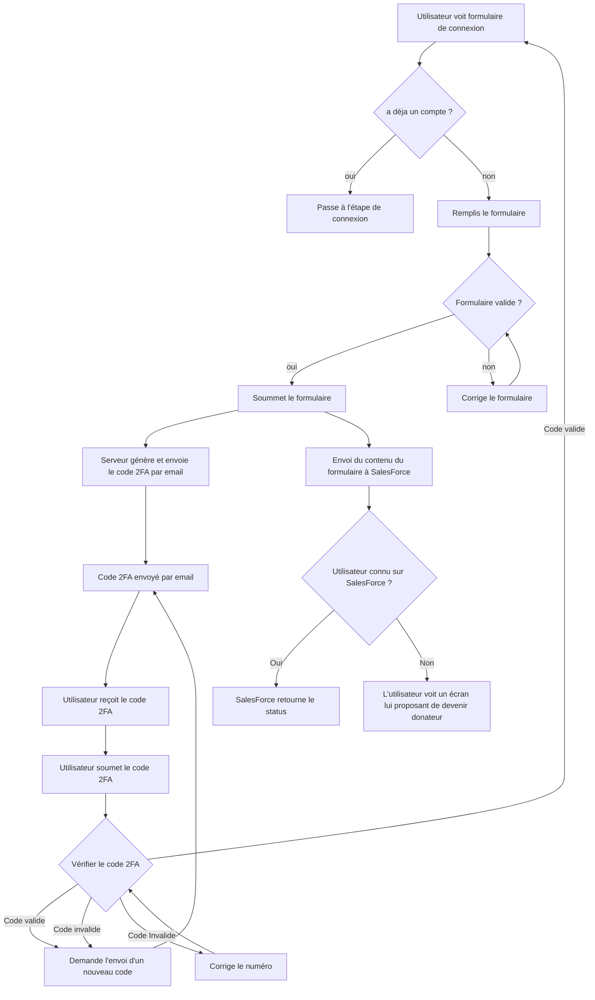
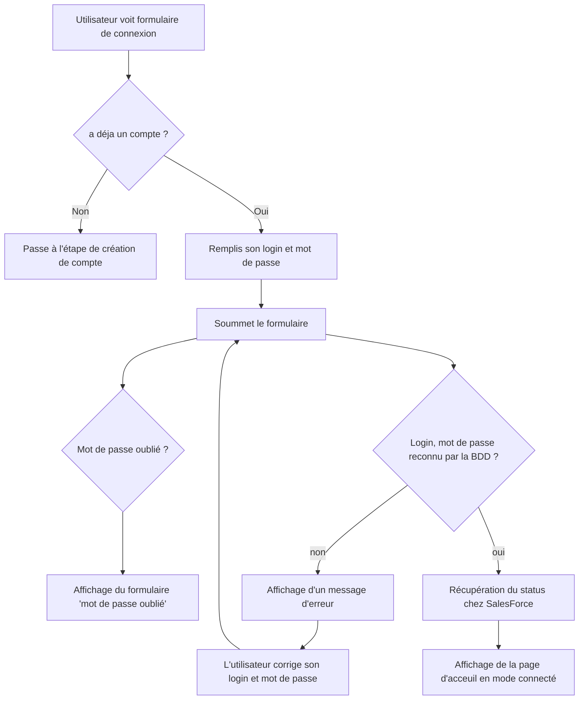

# ADR 001 - Connexion/Création de compte

## Point vocabulaire :

1. **SalesForce**: Désigne l'outil SalesForce utilisé par Amnesty pour la gestion des donateurs et des membres
2. **BDD** : désigne la Base de données utilisée par le site web.
3. **2FA** : "2 facteur authentification" (authentification à double facteur), désigne un mécanisme qui demande de valider l'authentification par un autre mécanisme (réception d'un code par email, téléphone, ...) en plus de son mot de passe

## A. Création de compte

### Contexte

Cette fonctionnalité a pour objectif de permettre à un utilisateur de créer un compte

### Synthèse des règles métiers(*)

- la 2FA sert à vérifier que l'utilisateur est bien un humain (et pas un bot)
- Si l'utilisateur n'est pas connu par Saleforce, il ne peut créer de compte

(*) Les règles métiers sont indiquées sur le Linear. 

### Schéma du parcours utilisateur

### Questions en suspens :

1. Que stocke-t-on en BDD ?

Réponse préférable : le strict minimum. Que le login et le mot de passe.

2. Quels status à un utilisateur après son inscription ?

## B. Connexion

